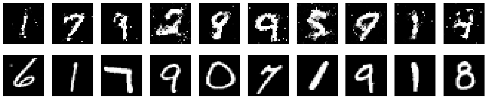

### 라이브러리 임포트 및 데이터셋 다운로드
```python
import torch
import torch.nn as nn
import torch.optim as optim
from torchvision import datasets, transforms
import matplotlib.pyplot as plt
import torchvision
from torch.utils.data import DataLoader
from torch.utils.tensorboard import SummaryWriter

# 데이터셋 로드 및 전처리
transform = transforms.Compose([
    transforms.ToTensor(),
    transforms.Normalize((0.5,), (0.5,))
])

train_dataset = datasets.MNIST(root='./data', train=True, download=True, transform=transform)
train_loader = torch.utils.data.DataLoader(dataset=train_dataset, batch_size=64, shuffle=True)

test_dataset = datasets.MNIST(root='./data', train=False, download=True, transform=transform)
test_loader = torch.utils.data.DataLoader(dataset=test_dataset, batch_size=64, shuffle=False)
```

```python
device = torch.device("cuda" if torch.cuda.is_available() else "cpu")
```

### 생성자 모델
```python
d_noise = 100
d_hidden_1 = 128
d_hidden_2 = 256
image_dim = 28*28
batch_size = 64

class Generator(nn.Module):
    def __init__(self):
        super(Generator, self).__init__()
        # 인코더
        self.generator = nn.Sequential(
            nn.Linear(d_noise, d_hidden_1),
            nn.ReLU(),
            nn.Dropout(0.1),
            nn.Linear(d_hidden_1,d_hidden_2),
            nn.ReLU(),
            nn.Dropout(0.1),
            nn.Linear(d_hidden_2, 28*28),
            nn.Tanh()
        ).to(device)

    def forward(self, x):
        x = self.generator(x)
        return x
```
3개의 linear layer를 연결해서 구성한다.
앞서 데이터셋을 transform을 통해 [-1,1]범위로 정규화 했기에 tanh를 통해 범위를 맞춰준다.


### 판별자 모델
```python
class Discriminator(nn.Module):
    def __init__(self):
        super(Discriminator, self).__init__()

        self.discriminator = nn.Sequential(
            nn.Linear(28*28, d_hidden_1),
            nn.LeakyReLU(),
            nn.Dropout(0.1),
            nn.Linear(d_hidden_1, d_hidden_2),
            nn.LeakyReLU(),
            nn.Dropout(0.1),
            nn.Linear(d_hidden_2, 1),
            nn.Sigmoid()
        ).to(device)

    def forward(self, x):
        x = self.discriminator(x)
        return x
```

```python
disc = Discriminator().to(device)
gen = Generator().to(device)

fixed_noise = torch.randn((batch_size, d_noise)).to(device)

lr = 3e-4
num_epochs = 50

opt_disc = optim.Adam(disc.parameters(), lr=lr)
opt_gen = optim.Adam(gen.parameters(), lr=lr)
criterion = nn.BCELoss()

step = 0
```
옵티마이저는 따로 설정한다. (생성자와 판별자가 개별적으로 학습되어야 하기 때문에)

### 학습
```python
fake_list = []
real_list = []

for epoch in range(num_epochs):
    for batch_idx, (real, _) in enumerate(train_loader):
        real = real.view(-1, 784).to(device)
        batch_size = real.shape[0]

        ### Train Discriminator: max log(D(x)) + log(1 - D(G(z)))
        noise = torch.randn(batch_size, d_noise).to(device)
        fake = gen(noise)
        disc_real = disc(real).view(-1)
        lossD_real = criterion(disc_real, torch.ones_like(disc_real))
        disc_fake = disc(fake).view(-1)
        lossD_fake = criterion(disc_fake, torch.zeros_like(disc_fake))
        lossD = (lossD_real + lossD_fake) / 2
        disc.zero_grad()
        lossD.backward(retain_graph=True)
        opt_disc.step()

        ### Train Generator: min log(1 - D(G(z))) <-> max log(D(G(z))
        # where the second option of maximizing doesn't suffer from
        # saturating gradients
        output = disc(fake).view(-1)
        lossG = criterion(output, torch.ones_like(output))
        gen.zero_grad()
        lossG.backward()
        opt_gen.step()

        if batch_idx == 0:
            print(
                f"Epoch [{epoch}/{num_epochs}] Loss D: {lossD:.4f}, loss G: {lossG:.4f}"
            )

            with torch.no_grad():
                fake = gen(fixed_noise).reshape(-1, 1, 28, 28)
                data = real.reshape(-1, 1, 28, 28)

                fake_list.append(fake)
                real_list.append(data)
                step += 1
```

<pre>
Epoch [0/50] Loss D: 0.7159, loss G: 0.6727
Epoch [1/50] Loss D: 0.6477, loss G: 1.2555
Epoch [2/50] Loss D: 0.2668, loss G: 1.9305
Epoch [3/50] Loss D: 0.6920, loss G: 0.8988
Epoch [4/50] Loss D: 0.3337, loss G: 1.7131
Epoch [5/50] Loss D: 0.3472, loss G: 2.7893
Epoch [6/50] Loss D: 0.3949, loss G: 2.3831
Epoch [7/50] Loss D: 0.2605, loss G: 1.8892
Epoch [8/50] Loss D: 0.3746, loss G: 2.6403
Epoch [9/50] Loss D: 0.4283, loss G: 1.8569
Epoch [10/50] Loss D: 0.4355, loss G: 1.9770
Epoch [11/50] Loss D: 0.3428, loss G: 1.9272
Epoch [12/50] Loss D: 0.2965, loss G: 2.2461
Epoch [13/50] Loss D: 0.3955, loss G: 1.5801
Epoch [14/50] Loss D: 0.4014, loss G: 1.9037
Epoch [15/50] Loss D: 0.4122, loss G: 1.3251
Epoch [16/50] Loss D: 0.3757, loss G: 1.8474
Epoch [17/50] Loss D: 0.3992, loss G: 1.6062
Epoch [18/50] Loss D: 0.4391, loss G: 1.2514
Epoch [19/50] Loss D: 0.4677, loss G: 1.5690
Epoch [20/50] Loss D: 0.5096, loss G: 1.4524
Epoch [21/50] Loss D: 0.4711, loss G: 1.5426
Epoch [22/50] Loss D: 0.5122, loss G: 1.1053
Epoch [23/50] Loss D: 0.4530, loss G: 1.0703
Epoch [24/50] Loss D: 0.4736, loss G: 1.0430
Epoch [25/50] Loss D: 0.4624, loss G: 1.1911
Epoch [26/50] Loss D: 0.4732, loss G: 1.2934
Epoch [27/50] Loss D: 0.5107, loss G: 1.2178
Epoch [28/50] Loss D: 0.5501, loss G: 0.9747
Epoch [29/50] Loss D: 0.4784, loss G: 1.3595
Epoch [30/50] Loss D: 0.5106, loss G: 1.3720
Epoch [31/50] Loss D: 0.4833, loss G: 1.0384
Epoch [32/50] Loss D: 0.5810, loss G: 1.1344
Epoch [33/50] Loss D: 0.4862, loss G: 1.5289
Epoch [34/50] Loss D: 0.5265, loss G: 1.0473
Epoch [35/50] Loss D: 0.5406, loss G: 1.1584
Epoch [36/50] Loss D: 0.5703, loss G: 1.0672
Epoch [37/50] Loss D: 0.5271, loss G: 1.1212
Epoch [38/50] Loss D: 0.5204, loss G: 0.9547
Epoch [39/50] Loss D: 0.5087, loss G: 1.1303
Epoch [40/50] Loss D: 0.6813, loss G: 1.1080
Epoch [41/50] Loss D: 0.5475, loss G: 1.0448
Epoch [42/50] Loss D: 0.6252, loss G: 1.0157
Epoch [43/50] Loss D: 0.5721, loss G: 1.1129
Epoch [44/50] Loss D: 0.5920, loss G: 0.9395
Epoch [45/50] Loss D: 0.5257, loss G: 1.3090
Epoch [46/50] Loss D: 0.5714, loss G: 0.8673
Epoch [47/50] Loss D: 0.6864, loss G: 0.8429
Epoch [48/50] Loss D: 0.6268, loss G: 0.9532
Epoch [49/50] Loss D: 0.5116, loss G: 1.3111
</pre>


```python
# 원본 이미지와 복원된 이미지 시각화
fig, axes = plt.subplots(nrows=2, ncols=10, sharex=True, sharey=True, figsize=(20, 4))

for images, row in zip([fake_list[-1], real_list[-1]], axes):
    for img, ax in zip(images, row):
        ax.imshow(img.cpu().numpy().squeeze(), cmap='gray')
        ax.get_xaxis().set_visible(False)
        ax.get_yaxis().set_visible(False)

plt.show()
```



