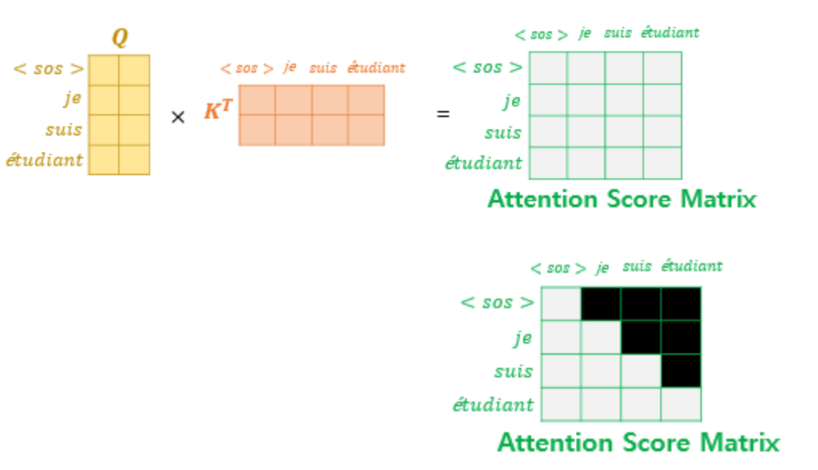

---

---

<head>
  <style>
    table.dataframe {
      white-space: normal;
      width: 100%;
      height: 240px;
      display: block;
      overflow: auto;
      font-family: Arial, sans-serif;
      font-size: 0.9rem;
      line-height: 20px;
      text-align: center;
      border: 0px !important;
    }

    table.dataframe th {
      text-align: center;
      font-weight: bold;
      padding: 8px;
    }

    table.dataframe td {
      text-align: center;
      padding: 8px;
    }

    table.dataframe tr:hover {
      background: #b8d1f3; 
    }

    .output_prompt {
      overflow: auto;
      font-size: 0.9rem;
      line-height: 1.45;
      border-radius: 0.3rem;
      -webkit-overflow-scrolling: touch;
      padding: 0.8rem;
      margin-top: 0;
      margin-bottom: 15px;
      font: 1rem Consolas, "Liberation Mono", Menlo, Courier, monospace;
      color: $code-text-color;
      border: solid 1px $border-color;
      border-radius: 0.3rem;
      word-break: normal;
      white-space: pre;
    }

  .dataframe tbody tr th:only-of-type {
      vertical-align: middle;
  }

  .dataframe tbody tr th {
      vertical-align: top;
  }

  .dataframe thead th {
      text-align: center !important;
      padding: 8px;
  }

  .page__content p {
      margin: 0 0 0px !important;
  }

  .page__content p > strong {
    font-size: 0.8rem !important;
  }

  </style>
</head>


# 트랜스포머 구현하기

## 트랜스포머의 구조

### Encoder

embedding된 시퀀스를 입력받아 
positional encoding 후,
multi-head attention - feed forward로 구성
#### Self Attention
```python
import torch
import torch.nn as nn
import torch.nn.functional as F

class SelfAttention(nn.Module):
    def __init__(self, embed_size, attention_size):
        super(SelfAttention, self).__init__()
        self.embed_size = embed_size
        self.attention_size = attention_size

        self.V = nn.Linear(self.embed_size, self.attention_size, bias=False)  
        self.K = nn.Linear(self.embed_size, self.attention_size, bias=False)
        self.Q = nn.Linear(self.embed_size, self.attention_size, bias=False)
        #(embed_size * attention_size)


    def forward(self, x):
        query = self.Q(x)
        key = self.K(x)
        value = self.V(x) 
        #(seq_len, embeded_size) * (embed_size, attention_size) 
        # -> (seq_len, attention_size)

        attention_score = F.softmax(query @ key.transpose(-2,-1) / 
					    (self.embed_size ** (1 / 2)), dim = -1)
        #(seq_len, attention_size) * (attention_size, seq_len) 
        # -> (seq_len, seq_len)
        out = attention_score @ value 
        #(seq_len, seq_len) * (seq_len, attention_size) 
        # -> (seq_len, attention_size)
        return out, key, value
```
Q, K, V layer를 통과하여 생성된 query, key, value matrix
scaled dot production으로 attention score를 계산한다.

```python
def test_self_attention():
    # Set random seed for reproducibility
    torch.manual_seed(42)

    # Define dimensions
    batch_size = 32
    seq_length = 10
    embed_size = 64
    attention_size = 32

    # Create an instance of SelfAttention
    self_attention = SelfAttention(embed_size, attention_size)

    # Create a random input tensor
    x = torch.randn(batch_size, seq_length, embed_size)

    # Forward pass
    output, _, _ = self_attention(x)

    # Print shapes
    print(f"Input shape: {x.shape}")
    print(f"Output shape: {output.shape}")

    # Check if output shape is correct
    assert output.shape == (batch_size, seq_length, attention_size), 
						    "Output shape is incorrect"

    # Check if output values are finite
    assert torch.isfinite(output).all(), "Output contains non-finite values"

    print("All checks passed!")

# Run the test
test_self_attention()
```

<pre>
Input shape: torch.Size([32, 10, 64])
Output shape: torch.Size([32, 10, 32])
All checks passed!
</pre>

입출력 차원도 설계에 맞게 나온다.

#### Multi-Head Self Attention
```python
import torch
import torch.nn as nn
import torch.nn.functional as F

class MultiHeadAttention(nn.Module):
    def __init__(self, embed_size, head_num):
        super(MultiHeadAttention, self).__init__()
        self.embed_size = embed_size
        self.head_num = head_num
        self.attention_size = self.embed_size // self.head_num

        self.multi_head_attention = nn.ModuleList([
            SelfAttention(self.embed_size, self.attention_size)
            for _ in range(self.head_num)
        ]) # (seq_len, attention_size)


    def forward(self, x):
        output = torch.cat([h(x)[0] for h in self.multi_head_attention], dim=-1) 
        # (seq_len, head_num * attention_size) + add(reisudal)
        x += output
        key = torch.cat([h(x)[1] for h in self.multi_head_attention], dim=-1)
        value = torch.cat([h(x)[2] for h in self.multi_head_attention], dim=-1)
        x = F.normalize(x, dim=-1) #normalization

        return x, key, value
```
attention_size = self.embed_size // self.head_num 딱 맞게 설정하도록 한다.

각각 attentiond을 계산 후, 결과를 concat한다.
이후 정규화항을 추가한다.
```python
def test_multi_head_attention():
    # Set random seed for reproducibility
    torch.manual_seed(42)

    # Define dimensions
    batch_size = 32
    seq_length = 10
    embed_size = 64
    head_num = 8

    # Create an instance of SelfAttention
    multi_head_attention = MultiHeadAttention(embed_size, head_num)

    # Create a random input tensor
    x = torch.randn(batch_size, seq_length, embed_size)

    # Forward pass
    output, _, _ = multi_head_attention(x)

    # Print shapes
    print(f"Input shape: {x.shape}")
    print(f"Output shape: {output.shape}")

    # Check if output shape is correct
    assert output.shape == (batch_size, seq_length, embed_size), 
						    "Output shape is incorrect"

    # Check if output values are finite
    assert torch.isfinite(output).all(), "Output contains non-finite values"

    print("All checks passed!")

# Run the test
test_multi_head_attention()
```

<pre>
Input shape: torch.Size([32, 10, 64])
Output shape: torch.Size([32, 10, 64])
All checks passed!
</pre>

#### FeedForward
```python
class FeedForward(nn.Module):
    def __init__(self, embed_size, hidden_size):
        super(FeedForward, self).__init__()

        self.embed_size = embed_size
        self.hidden_size = hidden_size
        self.fc1 = nn.Linear(self.embed_size, self.hidden_size)
        self.Relu = nn.ReLU()
        self.fc2 = nn.Linear(self.hidden_size, self.embed_size)

    def forward(self, x):
        x = self.fc1(x)
        x = self.Relu(x)
        x = self.fc2(x)

        return x
```
비선형성을 추가

```python
def test_feed_forward():
    # Set random seed for reproducibility
    torch.manual_seed(42)

    # Define dimensions
    batch_size = 32
    seq_length = 10
    embed_size = 64
    head_num = 8

    # Create an instance of SelfAttention
    multi_head_attention = MultiHeadAttention(embed_size, head_num)

    # Create a random input tensor
    x = torch.randn(batch_size, seq_length, embed_size)

    # Forward pass
    output = multi_head_attention(x)

    # Print shapes
    print(f"Input shape: {x.shape}")
    print(f"Output shape: {output.shape}")

    # Check if output shape is correct
    assert output.shape == (batch_size, seq_length, embed_size), 
						    "Output shape is incorrect"

    # Check if output values are finite
    assert torch.isfinite(output).all(), "Output contains non-finite values"

    print("All checks passed!")

# Run the test
test_multi_head_attention()
```

<pre>
Input shape: torch.Size([32, 10, 64])
Output shape: torch.Size([32, 10, 64])
All checks passed!
</pre>

### Decoder


임베딩 시퀀스를 입력으로 받는다.
masked attention 이후, multihead attention(encoder-decoder attention)은 
encoder 마지막 레이어의 key, value를 받고 이전 attention의 query를 가져온다.

#### Masked Attention
```python
class MaskedAttention(nn.Module):
    def __init__(self, embed_size, attention_size):
        super(MaskedAttention, self).__init__()
        self.embed_size = embed_size
        self.attention_size = attention_size

        self.V = nn.Linear(self.embed_size, self.attention_size, bias=False) #embed_size * attention_size
        self.K = nn.Linear(self.embed_size, self.attention_size, bias=False)
        self.Q = nn.Linear(self.embed_size, self.attention_size, bias=False)


    def forward(self, x):
        query = self.Q(x)
        key = self.K(x)
        value = self.V(x) 
        #(seq_len, embeded_size) * (embed_size, attention_size) 
        # -> (seq_len, attention_size)

        attention_score = F.softmax(query @ key.transpose(-2,-1) /
						         (self.embed_size ** (1 / 2)), dim = -1)
        #(seq_len, attention_size) * (attention_size, seq_len) 
        # -> (seq_len, seq_len)
        subsequent_mask = torch.triu(torch.ones(
					        attention_score.shape), diagonal=1) #masking
        attention_score = attention_score.masked_fill(subsequent_mask == 1, 
									        float("-1e20")) #masking
        out = attention_score @ value 
        #(seq_len, seq_len) * (seq_len, attention_size) 
        # -> (seq_len, attention_size)

        return out, query
```
입력 시퀀스의 어텐션이 미래 상태를 참조하지 못하게 하기 위해
해당 time step의 미래 attention을 마스킹한다.


```python
class MaskedMultiHeadAttention(nn.Module):
    def __init__(self, embed_size, head_num):
        super(MaskedMultiHeadAttention, self).__init__()
        self.embed_size = embed_size
        self.head_num = head_num
        self.attention_size = self.embed_size // self.head_num

        self.multi_head_attention = nn.ModuleList([
            MaskedAttention(self.embed_size, self.attention_size)
            for _ in range(self.head_num)
        ]) # (seq_len, attention_size)


    def forward(self, x):
        output = torch.cat([h(x)[0] for h in self.multi_head_attention], dim=-1) # (seq_len, head_num * attention_size) + add(reisudal)
        x += output
        query = torch.cat([h(x)[1] for h in self.multi_head_attention], dim=-1)
        x = F.normalize(x, dim=-1) #normalization

        return x, query
```

```python
def test_masekd_multi_head_attention():
    # Set random seed for reproducibility
    torch.manual_seed(42)

    # Define dimensions
    batch_size = 32
    seq_length = 10
    embed_size = 64
    head_num = 8

    # Create an instance of SelfAttention
    multi_head_attention = MaskedMultiHeadAttention(embed_size, head_num)

    # Create a random input tensor
    x = torch.randn(batch_size, seq_length, embed_size)

    # Forward pass
    output, _ = multi_head_attention(x)

    # Print shapes
    print(f"Input shape: {x.shape}")
    print(f"Output shape: {output.shape}")

    # Check if output shape is correct
    assert output.shape == (batch_size, seq_length, embed_size), "Output shape is incorrect"

    # Check if output values are finite
    assert torch.isfinite(output).all(), "Output contains non-finite values"

    print("All checks passed!")

# Run the test
test_masekd_multi_head_attention()
```

<pre>
Input shape: torch.Size([32, 10, 64])
Output shape: torch.Size([32, 10, 64])
All checks passed!
</pre>


#### Encoder Decoder Attention
```python
class EncoderDecoderAttention(nn.Module):
    def __init__(self, embed_size, head_num, K, V):
        super(EncoderDecoderAttention, self).__init__()
        self.embed_size = embed_size
        self.attention_size = embed_size // head_num

        self.V = V #embed_size * attention_size
        self.K = K


    def forward(self, Q):
        query = Q
        key = self.K
        value = self.V #(seq_len, embeded_size) * (embed_size, attention_size) -> (seq_len, attention_size)

        attention_score = F.softmax(query @ key.transpose(-2,-1) / (self.embed_size ** (1 / 2)), dim = -1)
        #(seq_len, attention_size) * (attention_size, seq_len) -> (seq_len, seq_len)
        out = attention_score @ value #(seq_len, seq_len) * (seq_len, attention_size) -> (seq_len, attention_size)

        return out
```
encoder의 key, value를 받아 해당 key, value
그리고 입력받은 query로 attention을 계산한다

```python
def test_encoder_decoder_attention():
    # Set random seed for reproducibility
    torch.manual_seed(42)

    # Define dimensions
    batch_size = 32
    seq_length = 10
    embed_size = 64
    head_num = 8

    # Create an instance of SelfAttention
    multi_head_attention = MultiHeadAttention(embed_size, head_num)
    masekd_multi_head_attention = MaskedMultiHeadAttention(embed_size, head_num)


    # Create a random input tensor
    x = torch.randn(batch_size, seq_length, embed_size)

    # Forward pass
    output1, key, value = multi_head_attention(x)
    output2, query = masekd_multi_head_attention(x)

    encoder_decoder_attention = EncoderDecoderAttention(embed_size, head_num, key, value)

    output3 = encoder_decoder_attention(output2)
    # Print shapes
    print(f"Input shape: {x.shape}")
    print(f"Output1 shape: {output1.shape}")
    print(f"Output2 shape: {output2.shape}")
    print(f"Output3 shape: {output3.shape}")
    # Check if output shape is correct
    assert output1.shape == (batch_size, seq_length, embed_size), 
						    "Output1 shape is incorrect"
    assert output2.shape == (batch_size, seq_length, embed_size), 
						    "Output2 shape is incorrect"
    assert output3.shape == (batch_size, seq_length, embed_size), 
						    "Output3 shape is incorrect"

    # Check if output values are finite
    #assert torch.isfinite(output).all(), "Output contains non-finite values"

    print("All checks passed!")

# Run the test
test_encoder_decoder_attention()
```

<pre>
Input shape: torch.Size([32, 10, 64])
Output1 shape: torch.Size([32, 10, 64])
Output2 shape: torch.Size([32, 10, 64])
Output3 shape: torch.Size([32, 10, 64])
All checks passed!
</pre>

#### Residual Connection
```python
class ResidualConnection(nn.Module):
    def __init__(self):
        super(ResidualConnection, self).__init__()

    def forward(self, x, residual):
        out = x + residual
        out = F.normalize(out, dim=-1)

        return out
```
각 layer 사이를 잔차연결한다.

## Encoder
```python
class EncoderLayer(nn.Module):
    def __init__(self, embed_size, head_num, hidden_size):
        super().__init__()
        self.multihead = MultiHeadAttention(embed_size=embed_size,
				         head_num=head_num)
        self.feed_forward = FeedForward(embed_size=embed_size, 
						    hidden_size=hidden_size)
        self.residual_layer1 = ResidualConnection()
        self.residual_layer2 = ResidualConnection()

    def forward(self, x):
        multihead_x, key, value = self.multihead(x)
        x = self.residual_layer1(x, multihead_x)
        feed_forward_x = self.feed_forward(x)
        x = self.residual_layer2(x, feed_forward_x)

        return x, key, value

embed_size = 256
heads = 8
hidden_size = 512

encoder = EncoderLayer(embed_size, heads, hidden_size)
x = torch.rand(10, 20, embed_size)  # (batch_size, sequence_length, embed_size)
print(x.shape)
output, key, value = encoder(x)
print(output.shape)  # Should be (10, 20, embed_size)
```

<pre>
torch.Size([10, 20, 256])
torch.Size([10, 20, 256])
</pre>


## Decoder
```python
class DecoderLayer(nn.Module):
    def __init__(self, embed_size, head_num, hidden_size, key, value):
        super().__init__()
        self.K = key
        self.V = value
        self.masked_multihead = MaskedMultiHeadAttention(embed_size=embed_size,
						        head_num=head_num)
        self.edAttention = EncoderDecoderAttention(embed_size=embed_size,
						    head_num=head_num, K=self.K, V=self.V)
        self.feed_forward = FeedForward(embed_size=embed_size,
					         hidden_size=hidden_size)
        self.residual_layer1 = ResidualConnection()
        self.residual_layer2 = ResidualConnection()
        self.residual_layer3 = ResidualConnection()

    def forward(self, x):
        masked_multihead_x, query = self.masked_multihead(x)
        x = self.residual_layer1(x, masked_multihead_x)
        edAttention_x = self.edAttention(x)
        x = self.residual_layer2(x, edAttention_x)
        feed_forward_x = self.feed_forward(x)
        x = self.residual_layer3(x, feed_forward_x)

        return x

embed_size = 256
heads = 8
hidden_size = 512

decoder = DecoderLayer(embed_size, heads, hidden_size, key, value)
x = torch.rand(10, 20, embed_size)  # (batch_size, sequence_length, embed_size)
print(x.shape)
output = decoder(x)
print(output.shape)  # Should be (10, 20, embed_size)
```

<pre>
torch.Size([10, 20, 256])
torch.Size([10, 20, 256])
</pre>


## To Do
layer 최적화 
encoder - decoder 연결