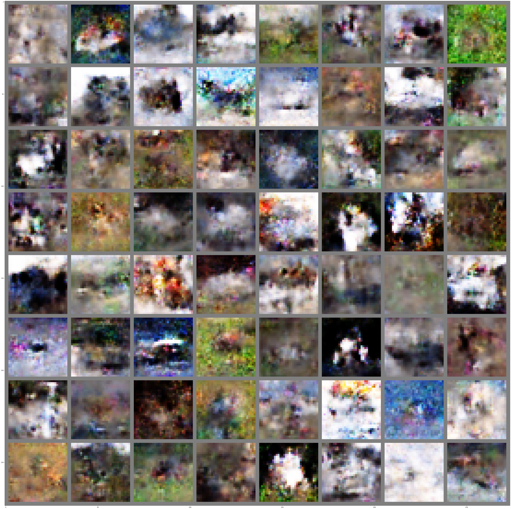
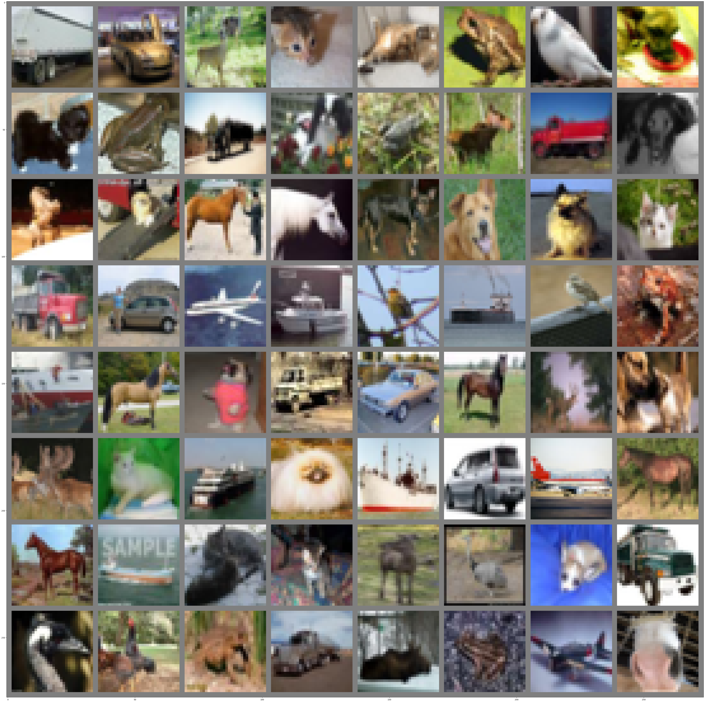
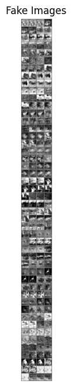

생성자
~~~python
class Generator(nn.Module):

def __init__(self):

super(Generator, self).__init__()

self.generator = nn.Sequential(

nn.ConvTranspose2d(d_noise, 256, kernel_size=8, stride=1, padding=0),

nn.ReLU(),

nn.ConvTranspose2d(256, 128, kernel_size=4, stride=2, padding=1),

nn.ReLU(),

nn.ConvTranspose2d(128, 3, kernel_size=4, stride=2, padding=1),

nn.Tanh()

)

  

def forward(self, x):

x = x.view(x.size(0), d_noise, 1, 1) # 입력 잡음 벡터를 (batch_size, d_noise, 1, 1) 형태로 변환

x = self.generator(x)

return x

  

def forward(self, x):

x = self.generator(x)

return x
~~~

판별자
~~~python
class Discriminator(nn.Module):

def __init__(self):

super(Discriminator, self).__init__()

  

self.discriminator = nn.Sequential(

nn.Linear(3*32*32, 1024),

nn.LeakyReLU(),

nn.Dropout(0.1),

nn.Linear(1024, 256),

nn.LeakyReLU(),

nn.Dropout(0.1),

nn.Linear(256, 10),

nn.Sigmoid()

).to(device)

  

def forward(self, x):

x = x.view(x.size(0), -1)

x = self.discriminator(x)

return x
~~~

학습
~~~python
fake_list = []

real_list = []

  

num_epochs = 10

  

for epoch in range(num_epochs):

for batch_idx, (real, _) in enumerate(train_loader):

real = real.view(-1, 3*32*32).to(device)

batch_size = real.shape[0]

  

### Train Discriminator: max log(D(x)) + log(1 - D(G(z)))

noise = torch.randn(batch_size, d_noise).view(batch_size, d_noise, 1, 1).to(device)

fake = gen(noise)

disc_real = disc(real).view(-1)

lossD_real = criterion(disc_real, torch.ones_like(disc_real))

disc_fake = disc(fake.view(-1, 3*32*32)).view(-1)

lossD_fake = criterion(disc_fake, torch.zeros_like(disc_fake))

lossD = (lossD_real + lossD_fake) / 2

disc.zero_grad()

lossD.backward(retain_graph=True)

opt_disc.step()

  

### Train Generator: min log(1 - D(G(z))) <-> max log(D(G(z))

# where the second option of maximizing doesn't suffer from

# saturating gradients

output = disc(fake.view(-1, 3*32*32)).view(-1)

lossG = criterion(output, torch.ones_like(output))

gen.zero_grad()

lossG.backward()

opt_gen.step()

  

if batch_idx == 0:

print(

f"Epoch [{epoch}/{num_epochs}] Loss D: {lossD:.4f}, loss G: {lossG:.4f}"

)

  

with torch.no_grad():

fake = gen(fixed_noise).reshape(-1, 3, 32, 32)

data = real.reshape(-1, 3, 32, 32)

  

fake_list.append(fake)

real_list.append(data)

step += 1
~~~

결과

생성 이미지

원본 이미지

생성 기록

