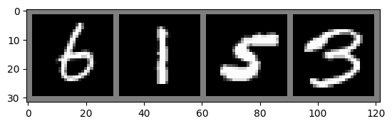

## 아이디어

GAN : noise -> image 생성
noise에 임베딩을 넣어준다면?

### 실험 1

사용 데이터셋 : CIFAR10

각 데이터셋의 label을 원핫인코딩 후, nn.Embedding를 사용하여 100차원 벡터로 변환
변환된 벡터를 입력으로 하는 생성자, 판별자를 학습.
GAN의 학습방식과 동일하게 학습.
```python
class Generator(nn.Module):
	def __init__(self):
		super(Generator, self).__init__()
		self.generator = nn.Sequential(
			nn.ConvTranspose2d(d_noise, 256, kernel_size=8, stride=1, padding=0),
			nn.ReLU(),
			nn.ConvTranspose2d(256, 128, kernel_size=4, stride=2, padding=1),
			nn.ReLU(),
			nn.ConvTranspose2d(128, 3, kernel_size=4, stride=2, padding=1),
			nn.Tanh()
		)
		
	def forward(self, x):
		x = x.view(x.size(0), d_noise, 1, 1)
		x = self.generator(x)
		return x
	
	def forward(self, x):
		x = self.generator(x)
		return x


class Discriminator(nn.Module):
	def __init__(self):
		super(Discriminator, self).__init__()
		self.discriminator = nn.Sequential(
			nn.Linear(3*32*32, 1024),
			nn.LeakyReLU(),
			nn.Dropout(0.1),
			nn.Linear(1024, 512),
			nn.LeakyReLU(),
			nn.Dropout(0.1),
			nn.Linear(512, 128),
			nn.LeakyReLU(),
			nn.Dropout(0.1),
			nn.Linear(128, 10),	
			nn.Sigmoid()
		).to(device)
	
	def forward(self, x):
		x = self.discriminator(x)
		return x
```
loss 세팅 :
lossD_real = criterion(disc_real, label_onehot)
lossD_fake = criterion(disc_fake, torch.zeros_like(disc_fake))
lossD = (lossD_real + lossD_fake)

lossG = criterion(output, label_onehot)

batch size = 4
epochs = 10

#### 결과

생성


원본


생성 기록


### 실험2

사용 데이터셋 : CIFAR10

claude-sonnet 3.5 코드 작성
사전학습된 bert사용 임베딩
인코더와 이미지생성모델을 학습
```python
class TextEncoder(nn.Module):
	def __init__(self):
		super(TextEncoder, self).__init__()
		self.bert = BertModel.from_pretrained('bert-base-uncased')
		self.fc = nn.Linear(768, 256)

	def forward(self, input_ids, attention_mask):
		outputs = self.bert(input_ids=input_ids, attention_mask=attention_mask)
		return self.fc(outputs.last_hidden_state[:, 0, :])

  

class ImageGenerator(nn.Module):
	def __init__(self):
		super(ImageGenerator, self).__init__()
		self.model = nn.Sequential(
			nn.Linear(256, 256 * 4 * 4),
			nn.ReLU(),
			nn.Unflatten(1, (256, 4, 4)),
			nn.ConvTranspose2d(256, 128, 4, 2, 1),
			nn.BatchNorm2d(128),
			nn.ReLU(),
			nn.ConvTranspose2d(128, 64, 4, 2, 1),
			nn.BatchNorm2d(64),
			nn.ReLU(),
			nn.ConvTranspose2d(64, 3, 4, 2, 1),
			nn.Tanh()
		)
	
	def forward(self, x):	
		return self.model(x)
```

loss 세팅 :
loss = criterion(generated_images, images)

batch size = 782
epochs = 50

#### 결과

생성


### 실험 3

사용 데이터셋 : CIFAR10

각 데이터셋의 label을 원핫인코딩 후, nn.Embedding를 사용하여 100차원 벡터로 변환
변환된 벡터를 입력으로 하는 생성자, 판별자를 학습.
GAN의 학습방식과 동일하게 학습.
~~~python
class Generator(nn.Module):
	def __init__(self):
		super(Generator, self).__init__()
			self.model = nn.Sequential(
			nn.Linear(embed_size, 256 * 4 * 4),
			nn.ReLU(),
			nn.Unflatten(1, (256, 4, 4)),
			nn.ConvTranspose2d(256, 128, 4, 2, 1),
			nn.BatchNorm2d(128),
			nn.ReLU(),
			nn.ConvTranspose2d(128, 64, 4, 2, 1),
			nn.BatchNorm2d(64),
			nn.ReLU(),
			nn.ConvTranspose2d(64, 3, 4, 2, 1),
			nn.Tanh()
		)
	
	def forward(self, x):
		return self.model(x)

class Discriminator(nn.Module):
	def __init__(self) -> None:
		super(Discriminator, self).__init__()
		self.conv1 = nn.Conv2d(in_channels=3, out_channels=12, 
					kernel_size=3, padding=1)
		self.bn1 = nn.BatchNorm2d(12)
		self.conv2 = nn.Conv2d(in_channels=12, out_channels=48, 
					kernel_size=3, padding=1)
		self.bn2 = nn.BatchNorm2d(48)
		self.conv3 = nn.Conv2d(in_channels=48, out_channels=192, 
					kernel_size=3, padding=1)
		self.bn3 = nn.BatchNorm2d(192)
		self.pool = nn.MaxPool2d(kernel_size=2, stride=2, padding=0)
		self.dropout = nn.Dropout(p=0.4)
		self.fc1 = nn.Linear(in_features=192*4*4, out_features=1024)
		self.fc2 = nn.Linear(in_features=1024, out_features=512)
		self.fc3 = nn.Linear(in_features=512, out_features=10)
		self.softmax = nn.Softmax(dim=1)
	
	  
	
	def forward(self, x):
		x = self.pool(nn.functional.relu(self.bn1(self.conv1(x)))) #32*32
		x = self.pool(nn.functional.relu(self.bn2(self.conv2(x)))) #16*16
		x = self.pool(nn.functional.relu(self.bn3(self.conv3(x)))) #8*8
		x = x.view(-1, 192*4*4)
		x = nn.functional.relu(self.fc1(x))
		x = self.dropout(x)
		x = nn.functional.relu(self.fc2(x))
		x = self.dropout(x)
		x = self.fc3(x)
		x = self.softmax(x)	
		return x
~~~
loss 세팅 :
lossD_real = criterion(disc_real.to(device), label_onehot.to(device))
lossD_real.backward()
lossD_fake = criterion(disc_fake.to(device), (1-label_onehot))
lossD_fake.backward()

lossG = criterion(output.to(device), label_onehot.to(device))
lossG.backward()


batch size = 64
epochs = 50

#### 결과

생성


원본


=> 3channel인 CIFAR10은 이미지 생성이 쉽지않구나! MNIST 데이터셋으로 실험

### 실험 4
사용 데이터셋 : MNIST

각 데이터셋의 label을 원핫인코딩 후, nn.Embedding를 사용하여 100차원 벡터로 변환
변환된 벡터를 입력으로 하는 생성자, 판별자를 학습.
판별자(분류기) 학습 후, 생성자 학습.
```python
class Generator(nn.Module):
	def __init__(self):
		super(Generator, self).__init__()
		self.generator = nn.Sequential(
			nn.ConvTranspose2d(d_noise, 256, kernel_size=7, stride=1, padding=0),
			nn.ReLU(),
			nn.ConvTranspose2d(256, 128, kernel_size=4, stride=2, padding=1),
			nn.ReLU(),
			nn.ConvTranspose2d(128, 1, kernel_size=4, stride=2, padding=1),
			nn.Tanh()
		)
	
	def forward(self, x):
		x = x.view(x.size(0), d_noise, 1, 1)
		x = self.generator(x)
		return x
		
	def forward(self, x):
		x = self.generator(x)
		return x


class Discriminator(nn.Module):
	def __init__(self):
		super(Discriminator, self).__init__()
		self.discriminator = nn.Sequential(
			nn.Linear(28*28, 512),
			nn.LeakyReLU(),
			nn.Dropout(0.1),
			nn.Linear(512, 256),
			nn.LeakyReLU(),
			nn.Dropout(0.1),
			nn.Linear(256, 10),
			nn.Softmax()
		).to(device)
	
	def forward(self, x):
		x = self.discriminator(x)
		return x

```
loss 세팅:
lossD_real = criterion(disc_real, label_onehot)
lossD_real.backward(retain_graph=True)

lossG = criterion(output, label_onehot)
lossG.backward()

batch size = 4
epochs = 50

#### 결과

생성


원본


생성 기록


### 실험 5

사용 데이터셋 : MNIST

각 데이터셋의 label을 원핫인코딩 후, nn.Embedding를 사용하여 100차원 벡터로 변환
변환된 벡터를 입력으로 하는 생성자, 판별자를 학습.
판별자(분류기) 학습 후, 생성자 학습.
~~~python
class Generator(nn.Module):
	def __init__(self):
		super(Generator, self).__init__()
		self.generator = nn.Sequential(
			nn.ConvTranspose2d(d_noise, 256, kernel_size=7, stride=1, padding=0),
			nn.ReLU(),
			nn.ConvTranspose2d(256, 128, kernel_size=4, stride=2, padding=1),
			nn.ReLU(),
			nn.ConvTranspose2d(128, 1, kernel_size=4, stride=2, padding=1),
			nn.Tanh()
		)
	
	def forward(self, x):
		x = x.view(x.size(0), d_noise, 1, 1)
		x = self.generator(x)
		return x
	
	def forward(self, x):
		x = self.generator(x)
		return x


class Discriminator(nn.Module):
	def __init__(self):
		super(Discriminator, self).__init__()
		self.discriminator = nn.Sequential(
			nn.Linear(28*28, 512),
			nn.LeakyReLU(),
			nn.Dropout(0.1),
			nn.Linear(512, 256),
			nn.LeakyReLU(),
			nn.Dropout(0.1),
			nn.Linear(256, 10),
			nn.Softmax(dim=1)
		).to(device)
	
	def forward(self, x):
		x = self.discriminator(x)
		return x
~~~
loss세팅 :
lossD_real = criterion(disc_real, label_onehot)
lossD_real.backward(retain_graph=True)

lossG = criterion(output, label_onehot)
lossG.backward()


batch size = 128
epochs = 50

#### 결과

생성


원본


생성 기록

